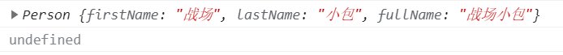
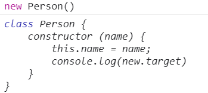
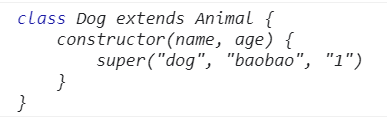

## 前言
前几天小包在开发时，遇到一个让小包非常难受的失误，现在回想起来都有几分头大，问题非常简单: 小包定义一个构造函数(使用 `ES5` 原生定义)，生成实例时忘记使用 `new` 关键字调用，进行了无意义的调用，生成错误的实例，调试好久小包才发现问题所在。


小包为了避免再有类似情况发生，希望构造函数未使用 `new` 关键字调用时，希望能抛出异常。本文记录小包寻找**非 new 调用 构造函数抛出异常**解决方案的过程。

## 明确函数的双重用途
`JavaScript` 中的函数一般有两种使用方式: 
+ 当作构造函数使用: `new Func()`
+ 当作普通函数使用: `Func()`

但 `JavaScript` 内部并没有区分两者的方式，我们人为规定**构造函数名首字母要大写**作为区分。也就是说，构造函数被当成普通函数调用不会有报错提示(心痛记录~~~)。

空口无凭，下面来举个栗子:

```js
// 定义构造函数 Person
function Person(firstName, lastName) {
    this.firstName = firstName;
    this.lastName = lastName;
    this.fullName = this.firstName + this.lastName;
}
// 使用 new 调用
console.log(new Person("战场", "小包"));
// 当作普通函数调用
console.log(Person("战场", "小包"))
```
输出结果: 



通过输出结果可以发现，定义的构造函数被当作普通函数来调用，没有任何错误提示。这很不合理，万一那次在粗心大意，就很容易复现小包的情况。
## 使用 instanceof 实现
### instanceof 基础知识
`instanceof` 运算符用于检测构造函数的 `prototype` 属性是否出现在某个实例对象的原型链上。

使用语法:
```js
object instanceof constructor
```

我们可以使用 `instanceof` 检测某个对象是不是另一个对象的实例，例如 ```new Person() instanceof Person --> true```
### new 绑定/ 默认绑定
+ 通过 `new` 来调用构造函数，会生成一个新对象，并且把这个新对象绑定为调用函数的 `this` 。
+ 如果普通调用函数，非严格模式 `this` 指向 `window`，严格模式指向 `undefined`

```js
function Test() {
    console.log(this)
}
// Window {...}
console.log(Test())
// Test {}
console.log(new Test())
```
使用 `new` 调用函数和普通调用函数最大的区别在于**函数内部 `this` 指向不同: `new` 调用后 `this` 指向实例，普通调用则会指向 `window`**。

`instanceof` 可以检测某个对象是不是另一个对象的实例。如果为 `new` 调用， `this` 指向实例，**this instanceof 构造函数** 返回值为 `true` ，普通调用返回值为 `false`。

### 代码实现

```js
function Person(firstName, lastName) {
    // this instanceof Person
    // 如果返回值为 false，说明为普通调用
    // 返回类型错误信息——当前构造函数需要使用 new 调用
    if (!(this instanceof Person)) {
        throw new TypeError('Function constructor A cannot be invoked without "new"')
    }
    this.firstName = firstName;
    this.lastName = lastName;
    this.fullName = this.firstName + this.lastName;
}
// 当作普通函数调用
// Uncaught TypeError: Function constructor A cannot be invoked without "new"
console.log(Person("战场", "小包"));
```
通过输出结果，我们可以发现，定义的 `Person` 构造函数已经无法被普通调用了。撒花~~~

但这种方案并不是完美的，存在一点小小的瑕疵。我们可以通过伪造实例的方法骗过构造函数里的判断。

具体实现: `JavaScript` 提供的 `apply/call` 方法可以修改 `this` 指向，如果调用时将 `this` 指向修改为 `Person` 实例，就可以成功骗过上面的语法。
```js
// 输出结果 undefined
console.log(Person.call(new Person(), "战场", "小包"));
```
这点瑕疵虽说无伤大雅，但经过小包的学习，`ES6` 中提供了更好的方案。
## new.target
`JavaScript` 官方也发现了这个让人棘手的问题，因此 `ES6` 中提供了 `new.target` 属性。

《ECMAScript 6 入门》中讲到: 
`ES6` 为 `new` 命令引入了一个 `new.target` 属性，该属性一般用在构造函数之中，返回 `new` 命令作用于的那个构造函数。如果构造函数不是通过 `new` 命令或 `Reflect.construct()` 调用的，`new.target` 会返回 `undefined` ，**因此这个属性可以用来确定构造函数是怎么调用的**。

`new.target` 就是为确定构造函数的调用方式而生的，太符合这个场景了，我们来试一下 `new.target` 的用法。
```js
function Person() {
    console.log(new.target);
}
// new: Person {}
console.log("new: ",new Person())
// not new: undefined
console.log("not new:", Person())
```
所以我们就可以使用 `new.target` 来非常简单的实现对构造函数的限制。

```js
function Person() {
    if (!(new.target)) {
        throw new TypeError('Function constructor A cannot be invoked without "new"')
    }
}
// Uncaught TypeError: Function constructor A cannot be invoked without "new"
console.log("not new:", Person())
```


## 使用ES6 Class

小包为什么上面不在 `ES6 Class` 中进行尝试那？因为小包发现类也具备限制构造函数只能用 `new` 调用的作用。

`ES6` 提供 `Class` 作为构造函数的语法糖，来实现语义化更好的面向对象编程，并且对 `Class` 进行了规定：**类的构造器必须使用 new 来调用**(悔不当初~~~)。

因此后续在进行面向对象编程时，强烈推荐使用 `ES6` 的 `Class`。 `Class` 修复了很多 `ES5` 面向对象编程的缺陷，例如类中的所有方法都是不可枚举的；类的所有方法都无法被当作构造函数使用等。

```js
class Person {
    constructor (name) {
        this.name = name;
    }
}
// Uncaught TypeError: Class constructor Person cannot be invoked without 'new'
console.log(Person())
```
学到这里我就不由得好奇了，既然 `Class` 必须使用 `new` 来调用，那提供 `new.target` 属性的意义在哪里？
## new.target 实现抽象类
首先来看一下 `new.target` 在类中使用会返回什么？
```js
class Person {
    constructor (name) {
        this.name = name;
        console.log(new.target)
    }
}
new Person()
```
输出结果:



`Class` 内部调用 `new.target`，会返回当前 `Class`。

《ECMAScript 6 入门》中又讲到: **需要注意的是，子类继承父类时，`new.target`会返回子类**。继承中的 `new.target` 好像有不一样的花样，我们来试一下。

```js
class Animal {
    constructor (type, name, age) {
        this.type = type;
        this.name = name;
        this.age = age;
        console.log(new.target)
    }
}
// extends 是 Class 中实现继承的关键字
class Dog extends Animal {
    constructor(name, age) {
        super("dog", "baobao", "1")
    }
}
const dog = new Dog()
```
输出结果:



通过上面案例，我们可以发现子类调用和父类调用的返回结果是不同的，我们利用这个特性，就可以实现父类不可调用而子类可以调用的情况——面向对象中的**抽象类**

### 抽象类实现
什么是抽象类那？我们以动物世界为例。

我们定义了一个动物类 `Animal`，并且通过这个类来创建动物，动物是个抽象概念，当你提到动物类时，你并不知道我会创建什么动物。只有将动物实体化，比如说猫，狗，猪啊，这才是具体的动物，并且每个动物的行为都会有所不同。因此我们不应该通过创建 `Animal` 实例来生成动物，`Animal` 只是动物抽象概念的集合。

`Animal` 就是一个抽象类，我们不应该通过它来生成动物，而是通过它的子类，例如 `Dog、Cat` 等来生成对应的 `dog/cat` 实例。

`new.target` 子类调用和父类调用的返回值是不同的，所以我们可以借助 `new.target` 实现抽象类

> 抽象类也可以理解为不能独立使用、必须继承后才能使用的类。
```js
class Animal {
    constructor (type, name, age) {
        if (new.target === Animal) {
            throw new TypeError("abstract class cannot new")
        }
        this.type = type;
        this.name = name;
        this.age = age;
    }
}
// extends 是 Class 中实现继承的关键字
class Dog extends Animal {
    constructor(name, age) {
        super("dog", "baobao", "1")
    }
}
// Uncaught TypeError: abstract class cannot new
const dog = new Animal("dog", "baobao", 18)
```
## 总结
本文小包学习了三种限制构造函数只能被 `new` 调用的方案
+ 借助 `instanceof` 和 `new` 绑定的原理，适用于低版本浏览器
+ 借助 `new.target` 属性，可与 `class` 配合定义抽象类
+ 面向对象编程使用 `ES6 class`——最佳方案

