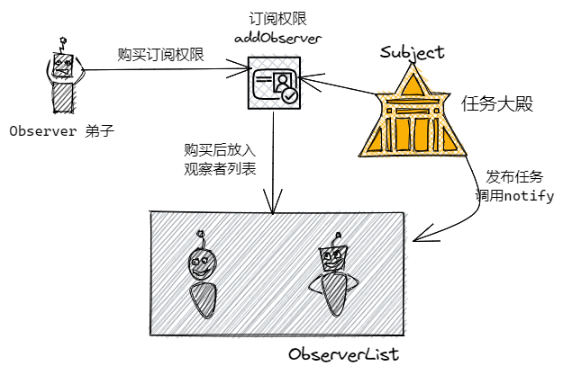
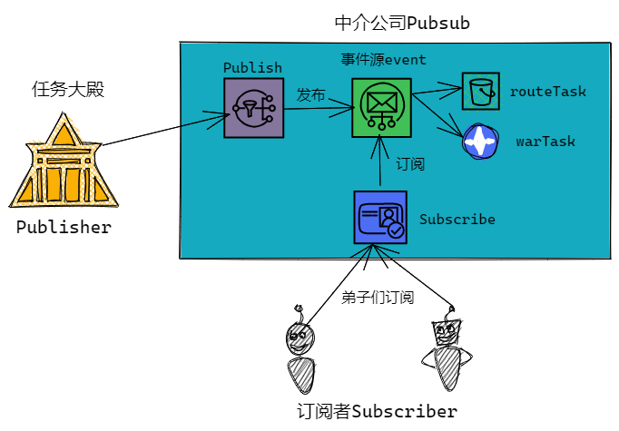
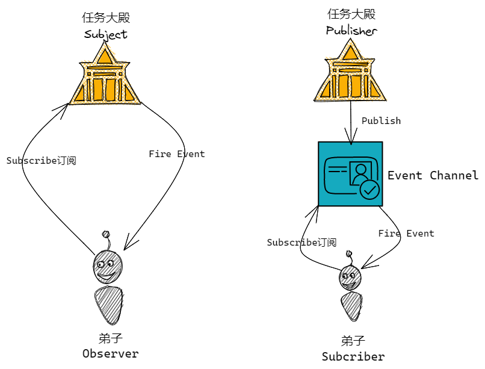

## 前言
观察者模式和发布订阅模式作为日常开发中经常使用到的模式，小包一直不能做到很好的区分，前几天在听手写promise源码时，老师又提到了两种模式。


赶得早不如赶得巧，最近小包正好在使用武侠风解读`JavaScript` ，小包决定一步到位，彻底学会观察者模式与发布订阅模式。


## 故事背景
前端宗门自从发布了传承方案后，宗门日渐繁荣，弟子们的水平不断提高，但新的问题出现了——高质量任务严重不足。宗门任务大殿每个月发布的五星任务是有限的，想要接取五星任务的弟子却如过江之鲫，于是滋生了**武侠黄牛**，恶意抢任务，坐地起价。

宗门不愿意任务被恶意哄抢，调整任务市场秩序，因此推出任务订阅功能——观察者模式。

## 观察者模式

任务订阅的大致功能是这样的: 宗门推出五星任务订阅功能，弟子通过购买获得订阅权限，当宗门发布五星任务后，会通知拥有订阅权限的弟子。

那么任务订阅功能中有两类主体:
1. 宗门任务大殿
  + 维护拥有订阅权限的弟子列表
  + 提供弟子购买订阅权限的功能
  + 发布对应任务后通知有订阅权限的弟子
2. 接受任务通知的弟子们

上面宗门任务大殿与弟子间的关系其实就构成了一个观察者模式。

**那什么是观察者模式那？** 当对象之间存在一对多的依赖关系时，其中一个对象的状态发生改变，所有依赖它的对象都会收到通知，这就是观察者模式。

在观察者模式中，只有两种主体：目标对象 (`Object`) 和 观察者 (`Observer`)。宗门任务大殿就是目标对象，弟子们就是观察者。
+ 目标对象 `Subject`:
  + 维护观察者列表 `observerList` ———— 维护拥有订阅权限的弟子列表
  + 定义添加观察者的方法 ———— 提供弟子购买订阅权限的功能
  + 当自身发生变化后，通过调用自己的 `notify` 方法依次通知每个观察者执行 `update` 方法 ———— 发布对应任务后通知有订阅权限的弟子
+ 观察者 `Observer` 需要实现 `update` 方法，供目标对象调用。`update`方法中可以执行自定义的业务逻辑 ———— 弟子们需要定义接收任务通知后的方法，例如去抢任务或任务不适合，继续等待下一个任务

我们把上面的文字形象化一下:



```js
class Observer {
    constructor(name) {
        this.name = name;
    }
    update({taskType, taskInfo}) {
        // 假设任务分为日常route和战斗war
        if (taskType === "route") {
            console.log(`${this.name}不需要日常任务`);
            return;
        }
        this.goToTaskHome(taskInfo);
        
    }
    goToTaskHome(info) {
        console.log(`${this.name}去任务大殿抢${info}任务`);
    }
}

class Subject {
    constructor() {
        this.observerList = []
    }
    addObserver(observer) {
        this.observerList.push(observer);
    }
    notify(task) {
        console.log("发布五星任务");
        this.observerList.forEach(observer => observer.update(task))
    }
}

const subject = new Subject();
const stu1 = new Observer("弟子1");
const stu2 = new Observer("弟子2");

// stu1 stu2 购买五星任务通知权限
subject.addObserver(stu1);
subject.addObserver(stu2);

// 任务殿发布五星战斗任务
const warTask = {
    taskType: 'war',
    taskInfo: "猎杀时刻"
}

// 任务大殿通知购买权限弟子
subject.notify(warTask);

// 任务殿发布五星日常任务
const routeTask = {
    taskType: 'route',
    taskInfo: "种树浇水"
}

subject.notify(warTask);

```

输出结果:
```js
// 战斗任务
发布五星任务
弟子1去任务大殿抢猎杀时刻任务
弟子2去任务大殿抢猎杀时刻任务

// 日常任务
发布五星任务
弟子1去任务大殿抢猎杀时刻任务
弟子2去任务大殿抢猎杀时刻任务
```

看到这里，不知道你可以理解观察者模式了？

小包再给附带一个案例: 比如你要应聘阿里巴巴的前端工程师，结果阿里巴巴 HR 告诉你没坑位了，留下你的电话，等有坑位联系你。于是，你美滋滋的留下了联系方式。殊不知，HR 已经留下了好多联系方式。好在 2022 年 2 月 30 号那天，阿里巴巴有了前端工程师的坑位，HR 挨着给留下的联系方式联系了一通。

案例中阿里巴巴就是目标对象 `Subject` ，联系方式列表就是用来维护观察者的 `observerList` ，根据前端职位的有无来调用 `notify` 方法。

## 发布——订阅模式
上文提到任务大殿提供五星任务订阅功能，但功能有几点问题:
+ 任务类型划分不明确，例如有的弟子只需要五星战斗任务，有的只需要五星日常任务，有的则全需要。

面对如此繁杂的问题，武侠中介公司应然而生。

因此目前就有了三种主体:

+ 宗门任务大殿: 任务发布者
+ 中介公司
  + 维护任务类型列表
  + 提供订阅任务功能 subscribe: 可以订阅战斗任务或日常任务
  + 提供任务发布功能 publish: 发布战斗任务或日常任务
+ 接受任务的弟子们

宗门任务大殿，中介公司，弟子就构成了一个发布订阅模式。

**那什么是发布订阅模式那？** 发布订阅模式指的是希望接收通知的对象（Subscriber）基于一个主题通过自定义事件订阅主题，发布事件的对象（Publisher）通过发布主题事件的方式通知各个订阅该主题的 Subscriber 对象。

发布订阅模式中有三个角色，发布者 `Publisher` ，事件调度中心 `Event Channel` ，订阅者 `Subscriber` 。
+ 发布者和订阅者是松散耦合的，互不关心对方是否存在 ———— 宗门任务大殿和弟子之间没有耦合，通过中介公司链接
+ 发布者只管发布任务 ———— 宗门任务大殿
+ 订阅者只管接受任务 ————— 接收任务的弟子们
+ 事件调度中心 ———— 中介公司
  + 维护任务事件的对象 ———— 维护任务类型列表
  + 给订阅者提供订阅功能 ———— 提供订阅任务功能 `subscribe`
  + 给订阅者发布事件信息 ———— 提供任务发布功能 `publish`




```js
class PubSub {
    constructor() {
        // 事件中心
        // 存储格式: warTask: [], routeTask: []
        // 每种事件(任务)下存放其订阅者的回调函数
        this.events = {}
    }
    // 订阅方法
    subscribe(type, cb) {
        if (!this.events[type]) {
            this.events[type] = [];
        }
        this.events[type].push(cb);
    }
    // 发布方法
    publish(type, ...args) {
        if (this.events[type]) {
            this.events[type].forEach(cb => cb(...args))
        }
    }
    // 取消订阅方法
    unsubscribe(type, cb) {
        if (this.events[type]) {
            const cbIndex = this.events[type].findIndex(e=> e === cb)
            if (cbIndex != -1) {
                this.events[type].splice(cbIndex, 1);
            }
        }
        if (this.events[type].length === 0) {
            delete this.events[type];
        }
    }
    unsubscribeAll(type) {
        if (this.events[type]) {
            delete this.events[type];
        }
    }
}

// 创建一个中介公司
let pubsub = new PubSub();

// 弟子一订阅战斗任务
pubsub.subscribe('warTask', function (taskInfo){
    console.log("宗门殿发布战斗任务，任务信息:" + taskInfo);
})
// 弟子一订阅战斗任务
pubsub.subscribe('routeTask', function (taskInfo) {
    console.log("宗门殿发布日常任务，任务信息:" + taskInfo);
});
// 弟子三订阅全类型任务
pubsub.subscribe('allTask', function (taskInfo) {
    console.log("宗门殿发布五星任务，任务信息:" + taskInfo);
});

// 发布战斗任务
pubsub.publish('warTask', "猎杀时刻");
pubsub.publish('allTask', "猎杀时刻");

// 发布日常任务
pubsub.publish('routeTask', "种树浇水");
pubsub.publish('allTask', "种树浇水");
```

输入结果:

```js
// 战斗任务
宗门殿发布战斗任务，任务信息:猎杀时刻
宗门殿发布五星任务，任务信息:猎杀时刻
// 日常任务
宗门殿发布日常任务，任务信息:种树浇水
宗门殿发布五星任务，任务信息:种树浇水
```

## 总结
上文中提到了观察者模式和发布——订阅模式，我们来总结一下两者差异:



| 设计模式 | 观察者模式  | 发布订阅模式  |
| --- | --- | --- |
|  主体| Object观察者、Subject目标对象 | Publisher发布者、Event Channel事件中心、Subscribe订阅者|
| 主体关系| Subject中通过observerList记录ObServer | Publisher和Subscribe不想知道对方存在，通过中介联系|
| 优点| 角色明确，Subject和Object要遵循约定的成员方法 | 松散耦合，灵活度高，通常应用在异步编程中 |
|缺点|紧耦合|当事件类型变多时，会增加维护成本|
|使用案例|双向数据绑定|事件总线EventBus|
