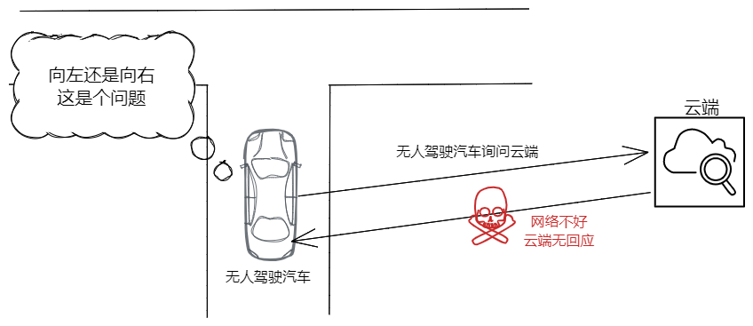

> 2022年了，还不拥抱端智能吗？

## 前言

## 云计算与边缘计算

云计算自提出后，它能利用现有资源，使用虚拟化技术构建由大量计算机组成的共享资源池，不仅具有功能强大的计算和监督能力，而且可以动态的分割和分配计算资源，以满足用户的不同需求，提供高效的交付服务。
其提供了庞大的计算能力、海量的数据存储能力。借助云计算的强大计算能力，物联网实现了跨越式发展，物联网设备连接数量和产生的数据呈海量增长趋势。一方面传统的采用集中处理方式的云计算模型已无法处理因各类接入设备产生的海量数据，让云端不堪重负，造成更大的数据瓶颈；另一方面，万物互联背景下，应用服务需要低延时、高可靠性以及数据安全，而传统云计算模式在实时性、隐私保护和能耗等问题上无法满足需求。 

于是边缘计算应然而生。

边缘计算指的是在网络边缘结点来处理、分析数据。边缘结点指的就是在数据产生源头和云中心之间任一具有计算资源和网络资源的结点。比如手机就可以是人与云中心之间的边缘节点，网关是智能家居和云中心之间的边缘结点。通常来说边缘计算把更多的计算进程放到边缘节点，云端运行较少的进程。这样，就可以实现在数据产生源附近计算、分析数据，最大限度减少客户端与云端的数据流转，进而减少云端响应时间和网络服务稳定。

但需要注意，边缘计算并非是云计算的“取代品”，边缘计算是云计算的补充和优化，它更靠近数据源头，能低时延近实时的解决问题。

例如在人脸识别领域，如果全部将部分计算任务移交给智能手机，将极大提高人脸识别的响应时间。

在进行边缘计算之前，智能手机扫描人的面部以进行面部识别将需要通过基于云的服务来运行面部识别算法，这将需要大量时间来处理。

边缘计算有下面的好处:
数据本地化，解决云端存储及隐私问题；
计算本地化，解决云端计算过载问题；
低通信成本，解决交互和体验问题；
去中心化计算，故障规避与极致个性化。

https://blog.csdn.net/ByteDanceTech/article/details/118981550

https://juejin.cn/post/6844904071925596173

## 云端智能 VS 端智能

与云计算到边缘计算类似，人工智能的发展也正在经历从云到端的过程。

我们回想一个人工智能应用的开发流程，一般有下列四步: 
+ 数据的采集与预处理
+ 模型的选取与训练
+ 模型效果评估
+ 模型的服务部署和推理

模型推理的方案一般是部署在云端或者服务器端，对外提供API给各端。但云智能面临着很多问题:
1. 响应速度: 数据的传输与响应依靠网络传输，稳定性和响应速度无法保持稳定，对于实时问题或低时延问题几乎无解。

比如无人驾驶汽车，驾驶过程中遇到了十字路口，此时恰好出现了网络波动，联系不到云端，那向左还是向右那？

2. 数据隐私性: 19 年工信部发出《关于开展APP侵害用户权益专项整治工作的通知》，说明我国对个人数据隐私性的重视在加强，应用想要获得大量数据发往云端变得困难，没有数据的云端就好比"巧妇难为无米之炊"。

相反的，如果数据在终端侧进行本地处理，安全性和隐私性可以得到很大保证。
除上述因素外，
## 端智能

