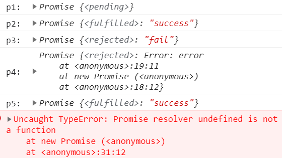

## 前言
小包前几天在听某课堂的公开课时，发现老师实现promise的思路非常好，在这个给大家分享一下。

本文章将沿着 Promises/A+规范的思路，一步一步的封装promise。
## 基础铺垫
promise是异步编程的一种解决方案，广泛用在日常编程中。目前我们使用的 Promise 是基于 Promise A+ 规范实现的，因此本文的主旋律也是沿着 promise A+ 规范实现。

promise必定处于下列三种状态之一:
+ Pending 等待态: promise 的初始状态，可以朝 Fulfilled 完成态 和 Rejected 失败态转变
+ Fulfilled 完成态: 代表 promise 已经完成
+ Rejected 失败态: 代表 promise 已经失败
+ 当promise处于 Pending 状态时，可以转变Fulfilled 或者 Rejected
> 当promise 处于 Fulfilled 或 Rejected时，状态不能再发生改变

promise中什么触发了状态的改变那？来看几个栗子:

```js
// p1 什么都不执行且传入空函数
const p1 = new Promise(()=>{})
console.log("p1: ", p1);

// p2 执行 resolve
const p2 = new Promise((resolve, reject)=> {
    resolve('success');
})
console.log("p2: ",p2);

// p3 执行 reject
const p3 = new Promise((resolve, reject) => {
    reject('fail');
})
console.log("p3: ",p3);

// p4 抛出错误
const p4 = new Promise((resolve, reject)=> {
    throw Error('error');
})
console.log("p4: ",p4);

// p5 先执行 resolve 后执行 reject
const p5 = new Promise((resolve, reject)=> {
    resolve('success');
    reject('fail');
})
console.log("p5: ",p5);

// p6 什么都不执行且不传参
const p6 = new Promise()
console.log("p6: ",p6);
```
我们来看一下输出结果:



从输出结果我们可以发现:
+ promise 的初始状态为 pending
+ 


首先我们先来看一下原生 Promise 的日常使用
```js
const promise = new Promise((resolve, reject) => {
    resolve('success')
    reject('error')
})
promise.then(value=> {
    console.log("resolve", value);
}, reason => {
    console.log("reject", reason);
})
// 输出结果
// resolve success
```
通过上面的简单实例，我们可以发现:
+ promise 是一个类，类执行时会传入一个执行器，并且执行器会立即执行
+ 执行器有两个参数: reslove/reject ，都是函数
+ 最终输出值 resolve success 说明执行了 resolve函数和 then 的第一个参数。


有了上面的基础，我们可以去看Promises/A+规范了。
## 实现成功和失败的回调方法
首先我们阅读promises/A+规范的Terminology和Promise States部分，我们可以得到两方面信息

1. value与reason的定义
   + value是任意的JavaScript合法值(包括indefined)
   + reason是用来表示promise为什么被拒绝的原因
2. promise 的状态
+ 

结合基础知识，我们就可以实现promise的第一版代码
+ 声明promise的三种状态 Pending Fulfilled Rejected

```js
const PENDING = "PENDING";
const FULFILLED = "FULFILLED";
const REJECTED = "REJECTED";
```

+ 创建 Proimse 类，传入执行器 executor，执行器 executor 立即执行

```js
class Promise{
    constructor(executor) {
        executor()
    }
}
```

+ 定义 promise 上的 value/reason ，默认值为 undefined;定义 promise 上的 status ，默认状态为 Pending

```js
class Promise{
    constructor(executor) {
        this.value = undefined;
        this.reason = undefined;
        this.status = PENDING;
        executor()
    }
}
```
+ 定义执行器 executor 的两个方法 resolve 和 reject，resolve和reject分别可以修改promise状态为fulfilled和rejected

```js
class Promise{
    constructor(executor) {
        this.value = undefined;
        this.reason = undefined;
        this.status = Pending;
        
        // 状态只能由 Pending --> Fulfilled 或者 Pending --> Rejected
        const resolve = (value) => {
            if (this.status === PENDING) {
                this.value = value;
                this.status = FULFILLED;
            }
        }
        const reject = (reason) => {
            if (this.status === PENDING) {
                this.reason = reason;
                this.status = REJECTED;
            }
        };

        executor(resolve, reject)
    }
}
```
> promise A+规范规定，在有异常错误时，则执行失败函数。因此要捕获executor的执行

我们将上面的代码整合一下。
```js
const PENDING = "PENDING";
const FULFILLED = "FULFILLED";
const REJECTED = "REJECTED";

class Promise{
    constructor(executor) {
        this.value = undefined;
        this.reason = undefined;
        this.status = Pending;
        
        // 状态只能由 Pending --> Fulfilled 或者 Pending --> Rejected
        const resolve = (value) => {
            if (this.status === PENDING) {
                this.value = value;
                this.status = FULFILLED;
            }
        }
        const reject = (reason) => {
            if (this.status === PENDING) {
                this.reason = reason;
                this.status = REJECTED;
            }
        };
        try{
            executor(resolve, reject)
        }catch(e) {
            reject(e);
        }
    }
}
```
## then调用——第一版代码
我们继续阅读promises/A+规范，promise必须提供一个then函数，then函数有两个参数，调用方式
```js
promise.then(onFulfilled, onRejected)
```


  

## 异步处理——第二版代码
## 链式调用——第三版代码
## 
## 边缘处理——第四版代码

