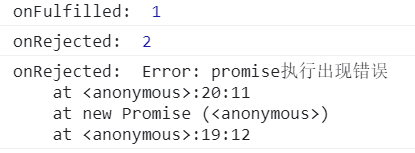

## 前言

小包前几天在听某课堂的公开课时，发现老师实现 promise 的思路非常好，在这个给大家分享一下。

本文章将沿着 Promises/A+ 规范的思路，一步一步的封装 promise。

## 基础铺垫

promise 是异步编程的一种解决方案，广泛用在日常编程中。目前我们使用的 Promise 是基于 Promise A+ 规范实现的，因此本文的主旋律也是沿着 promise A+ 规范实现。

promise 必定处于下列三种状态之一:

- Pending 等待态: promise 的初始状态
- Fulfilled 完成态: 代表 promise 已经完成
- Rejected 失败态: 代表 promise 已经失败
- 当 promise 处于 Pending 状态时，可以转变 Fulfilled 或者 Rejected
  > 当 promise 处于 Fulfilled 或 Rejected 时，状态不能再发生改变

promise 中什么触发了状态的改变那？我们来看几个栗子:

```js
// p1 什么都不执行且传入空函数
const p1 = new Promise(() => {});
console.log("p1: ", p1);

// p2 执行 resolve
const p2 = new Promise((resolve, reject) => {
  resolve("success");
});
console.log("p2: ", p2);

// p3 执行 reject
const p3 = new Promise((resolve, reject) => {
  reject("fail");
});
console.log("p3: ", p3);

// p4 抛出错误
const p4 = new Promise((resolve, reject) => {
  throw Error("error");
});
console.log("p4: ", p4);

// p5 先执行 resolve 后执行 reject
const p5 = new Promise((resolve, reject) => {
  resolve("success");
  reject("fail");
});
console.log("p5: ", p5);

// p6 什么都不执行且不传参
const p6 = new Promise();
console.log("p6: ", p6);
```

我们来看一下输出结果:


从输出结果我们可以发现:

- 创建 promise 对象时，需传入一个执行函数(否则会报错，详见 p6)，执行函数会立即执行
- promise 的初始状态为 pending(见 p1)
- 执行 resolve() 和 reject() 可以将 promise 的状态修改为 fulfilled 和 rejected (见 p2,p3)
- 若 promise 中抛出错误，相当于执行 reject (见 p4)
- promise 状态转变只能由 pending 开始(见 p5)

学完这些，我们就可以来写第一版代码了。

## 实现基础 promise —— 第一版

### promise 构造函数实现

1. 定义 promise 的三种状态

```js
const PENDING = "PENDING";
const FULFILLED = "FULFILLED";
const REJECTED = "REJECTED";
```

2. 定义 Promise 构造函数，添加必备属性

Promises/A+ 规范中指出:

- value 是任意的 JavaScript 合法值(包括 indefined)
- reason 是用来表示 promise 为什么被拒绝的原因

因此我们使用 ES6 class 定义 Promise 类，value/reason 分别赋值为 undefined ，状态 status 初始为 PENDING

```js
class Promise {
  constructor() {
    this.value = undefined;
    this.reason = undefined;
    this.status = PENDING;
  }
}
```

3. 定义 promise 时需要传入执行器 executor

- executor 有两个参数，分别为 resolve，reject
- executor 会立即执行

```js
class Promise {
  constructor(executor) {
    this.value = undefined;
    this.reason = undefined;
    this.status = PENDING;

    const resolve = () => {};
    const reject = () => {};

    executor(resolve, reject);
  }
}
```

4. 实现 resolve 和 reject 的功能
   - resolve 函数可以将 promise 由 pending 转变为 fulfilled，并且更新 promise 的 value 值
   - reject 函数可以将 promise 由 pending 转变为 rejected，并且更新 promise 的 reason 值
     > 注意: promise 状态只能由 Pending -> Fulfilled 和 Pending -> Rejected

```js
class Promise {
  constructor(executor) {
    this.value = undefined;
    this.reason = undefined;
    this.status = PENDING;

    const resolve = (value) => {
      // 判断当前的状态是否为Pending
      // promise状态转变只能从 Pending 开始
      if (this.status === PENDING) {
        // 更新 value 值和 promise 状态
        this.value = value;
        this.status = FULFILLED;
      }
    };
    const reject = (reason) => {
      if (this.status === PENDING) {
        this.reason = reason;
        this.status = REJECTED;
      }
    };

    executor(resolve, reject);
  }
}
```

5. promise A+ 规范规定，在有异常错误时，则执行失败函数。因此我们要捕获一下 executor 的执行。

```js
const PENDING = "PENDING";
const FULFILLED = "FULFILLED";
const REJECTED = "REJECTED";

class Promise {
  constructor(executor) {
    this.value = undefined;
    this.reason = undefined;
    this.status = PENDING;
    const resolve = (value) => {
      if (this.status === PENDING) {
        this.value = value;
        this.status = FULFILLED;
      }
    };
    const reject = (reason) => {
      if (this.status === PENDING) {
        this.reason = reason;
        this.status = REJECTED;
      }
    };
    // 捕获 executor 异常
    try {
      executor(resolve, reject);
    } catch (e) {
      // 当发生异常时，调用 reject 函数
      reject(e);
    }
  }
}
```

### 实现 then 方法的基本功能

then 方法的注意事项比较多，咱们一起阅读规范一起举例说明一下。

1. promise.then 接受两个参数:

```js
promise.then(onFulfilled, onRejected);
```

2. onFulfilled 和 onRejected 是可选参数，两者如果不是函数，则会**"忽略"**掉(真的是简单的忽略掉吗？请看下文分解)
3. 如果 onFulfilled 是一个函数，当 promise 状态为 Fulfilled 时，调用 onFulfilled 函数，onRejected 类似，当 promise 状态为 Rejeted 时调用。

我们继续来看几个案例:

```js
// 执行 resolve
const p1 = new Promise((resolve, reject) => {
  resolve(1);
});
p1.then(
  (v) => {
    console.log("onFulfilled: ", v);
  },
  (r) => {
    console.log("onRejected: ", r);
  }
);

// 执行 reject
const p2 = new Promise((resolve, reject) => {
  reject(2);
});
p2.then(
  (v) => {
    console.log("onFulfilled: ", v);
  },
  (r) => {
    console.log("onRejected: ", r);
  }
);

// 抛出异常
const p3 = new Promise((resolve, reject) => {
  throw new Error("promise执行出现错误");
});
p3.then(
  (v) => {
    console.log("onFulfilled: ", v);
  },
  (r) => {
    console.log("onRejected: ", r);
  }
);
```

我们来看一下输出结果:



通过上面的输出结果，我们可以初步分析出 then 的调用逻辑

- 执行 resolve 后，promise 状态改变为 fulfilled，onFulfilled 函数调用，参数值为 value。
- 执行 reject 或 抛出错误，promise 状态改变为 rejected ，onRejected 函数调用，参数值为 reason。

跟着上面的步骤，我们来模拟实现一下 then

```js
const PENDING = "PENDING";
const FULFILLED = "FULFILLED";
const REJECTED = "REJECTED";

class Promise {
  constructor(executor) {
    this.value = undefined;
    this.reason = undefined;
    this.status = PENDING;
    const resolve = (value) => {
      if (this.status === PENDING) {
        this.value = value;
        this.status = FULFILLED;
      }
    };
    const reject = (reason) => {
      if (this.status === PENDING) {
        this.reason = reason;
        this.status = REJECTED;
      }
    };
    // 捕获 executor 异常
    try {
      executor(resolve, reject);
    } catch (e) {
      reject(e);
    }
  }
  then(onFulfilled, onRejected) {
    // 当状态为 Fulfilled 时，调用 onFulfilled函数
    if (this.status === FULFILLED) {
      onFulfilled(this.value);
    }
    // 当状态为 Rejected 时，调用 onRejected 函数
    if (this.status === REJECTED) {
      onRejected(this.reason);
    }
  }
}
```

代码写到这里，第一版 promise 的代码就实现完成了。我们使用上面案例来测试一下，目前手写 promise 是否能实现基本功能。


输出结果如下:


跟原生 promise 的输出结果是相同的，因此，第一版 promise 实现是成功的。

### promise 执行多次 then 方法

我们继续往下读规范：

如果一个 promise 调用多次 then: 当 promise 状态为 Fulfilled 时，所有的 onFulfilled 函数按照注册顺序调用。当 promise 状态为 Rejected 时，所有的 onRejected 函数按照注册顺序调用。

这个规范讲的是什么意思那？小包来举个例子

```js
const p = new Promise((resolve, reject) => {
  resolve("success");
});

p.then((v) => {
  console.log(v);
});
p.then((v) => {
  console.log(`${v}--111`);
});
```

输出结果:

```js
success;
success-- - 111;
```

通过上面的案例，将该条规范总结:同一个 promise 可以注册多个 then 方法，then 方法回调的执行按照注册顺序。

我们测试一下第一版手写 Promise，输出结果为

```js
success;
success--- 111;
```
第一版代码是可以满足当前规范的，~~~，放松一下，我们来继续实现。
## 处理异步逻辑——第二版

文章刚开始我们就讲过，promise 是异步编程的一种解决方案，那我们来测试一下第一版 Promise 是否可以实现异步。

```js
const p = new Promise((resolve, reject) => {
  // 使用 setTimeout 模拟一下异步
  setTimeout(() => {
    resolve("success");
  });
});

p.then((v) => {
  console.log(v);
});
p.then((v) => {
  console.log(`${v}--111`);
});
```

没有任何输出，失败了，没事，我们来分析一下为何没有任何输出。

如果 Promise 内部存在异步调用，当执行到 then 函数时，此时由于 resolve/reject 处于异步回调之中，promise 的状态仍为 Pending，因此 onFulfilled 和 onRejected 都无法执行。

那我们应该如何实现异步调用那？我们来分析一下:

- 如果 promise 还处于 pending 状态时，就调用了 then 方法，说明是存在异步的。
- 由于此时无法调用 onFulfilled/onRejected，将 onFulfilled/onRejected 存储起来
- 当异步回调中执行 resolve 或者 reject 时，依次调用相应的 onFulfilled/onRejected

> 这里就形成一个简单的发布订阅模式，详情

### 代码实现

1. 在 promise 中定义两个数组 onFulfilledCallbacks 和 onRejectedCallbacks ，分别用来存储 onFulfilled 和 onRejected 函数

```js
class Promise {
    this.onFulfilledCallbacks = [];
    this.onRejectedCallbacks = [];
}
```

2. then 方法执行时，若 promise 处于 Pending 状态，将 onFulfilled 和 onRejected 函数分别压入 onFulfilledCallbacks 和 onRejectedCallbacks——形成订阅

```js
then(onFulfilled, onRejected) {
    if (this.status === FULFILLED) {
        onFulfilled(this.value);
    }
    if (this.status === REJECTED) {
        onRejected(this.reason);
    }
    if (this.status === PENDING) {
        // 添加订阅
        this.onFulfilledCallbacks.push(onFulfilled);
        this.onRejectedCallbacks.push(onRejected);
    }
}
```

3. 当调用 resolve/reject 时，分别执行 onFulfilledCallbacks 和 onRejectedCallbacks 数组中的函数

```js
const resolve = (value) => {
  if (this.status === PENDING) {
    this.value = value;
    this.status = FULFILLED;
    // 依次执行onFulfilled函数
    this.onFulfilledCallbacks.forEach((cb) => cb(this.value));
  }
};
const reject = (reason) => {
  if (this.status === PENDING) {
    this.reason = reason;
    this.status = REJECTED;
    // 依次执行onRejected函数
    this.onRejectedCallbacks.forEach((cb) => cb(this.reason));
  }
};
```
我们来整理一下代码，形成手写 Promise 第二版
```js
const PENDING = "PENDING";
const FULFILLED = "FULFILLED";
const REJECTED = "REJECTED";

class Promise {
  constructor(executor) {
    this.value = undefined;
    this.reason = undefined;
    this.status = PENDING;
    this.onFulfilledCallbacks = [];
    this.onRejectedCallbacks = [];
    const resolve = (value) => {
      if (this.status === PENDING) {
        this.value = value;
        this.status = FULFILLED;
        this.onFulfilledCallbacks.forEach((cb) => cb(this.value));
      }
    };
    const reject = (reason) => {
      if (this.status === PENDING) {
        this.reason = reason;
        this.status = REJECTED;
        this.onRejectedCallbacks.forEach((cb) => cb(this.reason));
      }
    };
    try {
      executor(resolve, reject);
    } catch (e) {
      console.log(e);
      reject(e);
    }
  }
  then(onFulfilled, onRejected) {
    if (this.status === FULFILLED) {
      onFulfilled(this.value);
    }
    if (this.status === REJECTED) {
      onRejected(this.reason);
    }
    if (this.status === PENDING) {
      // 添加订阅
      this.onFulfilledCallbacks.push(onFulfilled);
      this.onRejectedCallbacks.push(onRejected);
    }
  }
}
```
使用刚才的案例进行测试，输出结果为
```js
success
success--111
```
第二版 Promise 已经可以成功支持异步逻辑了，撒花~~~ 休息一会，我们继续进行第三版的封装。


## 链式调用
我们继续去读规范:

1. then 方法必须返回一个promise
```js
promise2 = promise1.then(onFulfilled, onRejected)
```
2. 如果 onFulfilled 或 onRejected 返回值 x ，则运行 `Promise Resolution Procedure [[Resolve]](promise2, x)`(这里暂且将他理解为 resolve(x))
```js
console.log(new Promise((resolve) => {
    resolve(1)
}).then((x) => x))
console.log(new Promise((resolve, reject) => {
    reject(1)
}).then(undefined,(x) => x))
```


3. 如果 onFulfilled 或 onRejected 抛出异常 e ，则 promise2 调用 reject(e)

```js
console.log(new Promise((resolve) => {
    resolve(1)
}).then(()=> {
    throw new Error('resolve err')
}))
console.log(new Promise((resolve, reject) => {
    reject(1)
}).then(undefined,()=> {
    throw new Error('reject err')
}))
```

4. 如果 onFulfilled 不是函数，且promise状态为Fulfilled，那么 promise2 应该接受同样的值，同时状态为 Fulfilled
```js
// 输出结果 1
const p1 = new Promise((resolve) => {
    resolve(1)
})
p1.then(x => x).then().then().then().then().then(x=> console.log(x))
```
5. 如果 onRejected 不是函数，且promise状态为Rejected，那么 promise2 应该接受同样的原因，同时状态为 Rejected

```js
// 输出结果 Error: error at <anonymous>:4:33
const p1 = new Promise((resolve) => {
    reject(1)
})
p1.then(undefined, () => {throw Error('error')}).then().then().then().then().then(x=> console.log(x), (r)=> console.log(r))
```

### 代码实现
那我们就照着规范一步一步的实现它

1. then 需要返回一个 promise，递归调用 Promise，在then中定义一个 promise 并返回
```js
then(onFulfilled, onRejected) {
  if (this.status === FULFILLED) {
    onFulfilled(this.value);
  }
  if (this.status === REJECTED) {
    onRejected(this.reason);
  }
  if (this.status === PENDING) {
    this.onFulfilledCallbacks.push(onFulfilled);
    this.onRejectedCallbacks.push(onRejected);
  }
  // 返回 promise2
  const promise2 = new Promise((resolve, reject)=> {})
  return promise2;
}
```
2. 如果 onFulfilled 或 onRejected 返回值 x ，则调用返回 promise2 的 resolve 函数。

由于需要调用 promise2 deresolve函数，那说明 onFulfilled 和 onRejected 调用发生在 promise2 的executor中。

难点在于如何处理 Pending 状态，当 promise 处于 Pending 状态时，我们将 onFulfilled 和 onRejected 函数先存储起来。但是链式调用需要 onFulfilled/onRejected 函数的返回值，因此我们不能简单的将函数存储起来。

我们将函数封装成下面效果，然后存储起来。
```js
() => {
  let x = onFulfilled(this.value);
  resolve(x);
}
```
因此目前的 then 方法:
```js
then(onFulfilled, onRejected) {
  let promise2 = new Promise((resolve, reject) => {
    if (this.status === FULFILLED) {
      let x = onFulfilled(this.value);
      resolve(x);
    }
    if (this.status === REJECTED) {
      let x = onRejected(this.reason);
      resolve(x);
    }
    if (this.status === PENDING) {
      this.onFulfilledCallbacks.push(() => {
        let x = onFulfilled(this.value);
        resolve(x);
      });
      this.onRejectedCallbacks.push(() => {
        let x = onRejected(this.reason);
        resolve(x);
      });
    }
  });
  return promise2;
}
```
3. 如果 onFulfilled 或 onRejected 抛出异常 e ，则 promise2 调用 reject(e)

使用 try catch 捕捉函数执行，当出现异常，执行 reject(e)

```js
then(onFulfilled, onRejected) {
  let p1 = new Promise((resolve, reject) => {
    if (this.status === FULFILLED) {
      try {
        let x = onFulfilled(this.value);
        resolve(x);
      } catch (e) {
        reject(e);
      }
    }
    if (this.status === REJECTED) {
      try {
        let x = onRejected(this.reason);
        resolve(x);
      } catch (e) {
        reject(e);
      }
    }
    if (this.status === PENDING) {
      // 添加订阅
      this.onFulfilledCallbacks.push(() => {
        try {
          let x = onFulfilled(this.value);
          resolve(x);
        } catch (e) {
          reject(e);
        }
      });
      this.onRejectedCallbacks.push(() => {
        try {
          let x = onRejected(this.reason);
          resolve(x);
        } catch (e) {
          reject(e);
        }
      });
    }
  });
  return p1;
}
```
4. 处理 onFulfilled 和 onRejected 非函数情况。

通过上面的案例，我们可以发现，当 onFulfilled 不是函数时，then方法将其的值传递下去；当 onRejected 不是函数时，then 方法同样会传递错误。

我们如何才能连续传递值或者异常那？我们来看一下下面这两个函数，是否能满足要求

```js
x => x;
e => throw e;
```

```js
const PENDING = "PENDING";
const FULFILLED = "FULFILLED";
const REJECTED = "REJECTED";

class Promise {
  constructor(executor) {
    this.value = undefined;
    this.reason = undefined;
    this.status = PENDING;
    this.onFulfilledCallbacks = [];
    this.onRejectedCallbacks = [];
    // this指向问题
    const resolve = (value) => {
      if (this.status === PENDING) {
        this.value = value;
        this.status = FULFILLED;
        this.onFulfilledCallbacks.forEach((cb) => cb(this.value));
      }
    };
    const reject = (reason) => {
      if (this.status === PENDING) {
        this.reason = reason;
        this.status = REJECTED;
        this.onRejectedCallbacks.forEach((cb) => cb(this.reason));
      }
    };
    try {
      executor(resolve, reject);
    } catch (e) {
      reject(e);
    }
  }
  then(onFulfilled, onRejected) {
    onFulfilled = typeof onFulfilled === "function" ? onFulfilled : (v) => v;
    onRejected =
      typeof onRejected === "function"
        ? onRejected
        : (e) => {
            throw e;
          };
    let promise2 = new Promise((resolve, reject) => {
      if (this.status === FULFILLED) {
        try {
          let x = onFulfilled(this.value);
          resolve(x);
        } catch (e) {
          reject(e);
        }
      }
      if (this.status === REJECTED) {
        try {
          let x = onRejected(this.reason);
          resolve(x);
        } catch (e) {
          reject(e);
        }
      }
      if (this.status === PENDING) {
        // 添加订阅
        this.onFulfilledCallbacks.push(() => {
          try {
            let x = onFulfilled(this.value);
            resolve(x);
          } catch (e) {
            reject(e);
          }
        });
        this.onRejectedCallbacks.push(() => {
          try {
            let x = onRejected(this.reason);
            resolve(x);
          } catch (e) {
            reject(e);
          }
        });
      }
    });
    return promise2;
  }
}
```

## 实现resolvePromise


