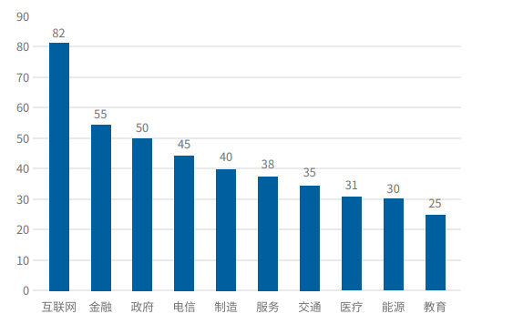

## 前言
人工智能是引领社会和经济发展的战略性技术之一，人工智能是诸多行业发展的核心。人工智能的发展日新月异，每天都发生着翻天覆地的变化，因此小包本文就对 `2022` 年甚至未来几年人工智能的发展提出六点洞察，一起来拥抱伟大的人工智能时代。
## 巨量模型是 AI 发展的大势所趋
虽非蟾宫谪降仙,何惧冰殿冷彻骨。窥帘斜视金屋小,多少俊才在此关。

上面这首名诗并非是中国古代那位大家之作，而是浪潮新近发布的全球最大规模人工智能巨量模型——**“源1.0”**的杰作。

“源1.0”，其参数量高达 `2457` 亿，借助文本分析模型，获取 `5TB` 高质量中文数据集，其作为语言模型可较好完成尤其针对中文的阅读、理解、推理、逻辑判断等任务。

为什么会出现如此体量巨大的模型那？随着各类行业人工智能场景应用的增多，`AI` 模型越来越多样化、复杂化，`AI` 小模型可以达成各行各业中的实际应用，但其通用性差、精准度存在局限性，更换应用场景，`AI` 小模型有可能并不适用。

“人工智能如何发展出像人类具备逻辑、意识和推理的认知能力，是人工智能研究一直在探索的方向。目前来看，通过大规模数据训练超大参数量的巨量模型，被认为是非常有希望实现通用人工智能的一个重要方向。”王恩东院士认为，随着巨量模型的兴起，巨量化已成为未来人工智能发展非常重要的一个趋势。

巨量模型将是规范化创新的基础。在过去的十年间全球范围内，人工智能模型参数大小逐级递增，由千万级增长至千亿级。`2020` 年，`OpenAI` 在发布` GPT-3` 深度学习模型具备 `1750` 亿参数，正式将语言模型带入千亿参数时代。`2021` 年，世界范围内也出现了几个超大模型，例如英文领域有微软和英伟达推出的 `MT-NLG` 巨量模型，具备 `5300` 亿参数；中文领域有浪潮推出的具备 `2457` 亿参数的源1.0，百度和 `PCL` 团队推出的具备 `2600` 亿参数的 `ERNIE 3.0 Titan` ， 甚至还有 `Switch Transformer` 这种 `1.6` 万亿参数的模型(`Switch Transformer` 使用混合专家 `Mix of Expert`，MoE，不是单体模型)

从 `2021` 年巨量模型的研究发展来看，巨量模型的趋势才刚刚开始，`2022` 年，甚至会推出万亿级别的单体模型。同时，巨量模型的资源使用方面的优化也会成为新的研究方向，相信未来会出现更多参数但需要更少 `GPU` 的巨量模型。

> 对于人工智能的发展来说，在实现理想泛化能力的基础上，越小的模型，将会更加广泛与灵活地适配应用场景。但在这条通完理想的道路上，首先需要使用大模型、通过提取海量有价值数据进行充分的训练和学习，才能逐渐调优至最优最理想结果，然后在进行小模型的训练，实现灵活广泛的适配。

## AI 不断超边缘侧渗透
> 边缘计算指的是在网络边缘结点来处理、分析数据。边缘结点指的就是在数据产生源头和云中心之间任一具有计算资源和网络资源的结点。比如手机就可以是人与云中心之间的边缘节点，网关是智能家居和云中心之间的边缘结点。

在物联网技术迅速发展的当下以及日益增长的业务实时性要求使边缘测和端侧计算能力变得越来越重要。例如在工业互联网中，对数据采集的准确性以及实时性要求不断提高，采集的数据量也越来越巨大。为了更好的实时分析数据以及处理海量终端数据并减轻云端网络传输压力，人工智能算力会不断向边缘渗透，无论是更接近端侧数据的轻边缘或者更接近核心数据中心的重边缘，`2022` 年，都将会迎来黄金发展契机。

`IDC` 预测，到 `2023` 年，将近 `20%` 的处理器将部署在边缘侧，用于处理 `AI` 工作负载；`70%` 的企业将在物联网边缘运行不同级别的数据处理。

端侧的发展同样会迎来黄金契机，端智能自身具有高实时、低时延、强隐私，近几年有着飞速的发展，广泛应用于人脸识别、手势识别、图像搜索、互动游戏等。虽然端智能存在算力不足的严重限制，但据 `IDC` 预测，**用于推理工作负载的服务器市场份额将在不久的将来超过训练，并在预测期内保持这一趋势**。而且随着各大公司不断推出算力性能更高的 `XPU` ，端智能受算力的限制会越来越小。

## AI 催生芯片多元化发展
在人工智能领域，数据、算法、算力是三个关键要素，而谈到算力，就离不开芯片，近年来，人工智能应用落地场景越来越丰富，因此人工智能芯片呈现出多元化发展趋势，通过不断演进的架构，为下一代计算提供源源不断的动力。

+ 从需求侧而言: 随着智能城市、智能制造、智能金融、自动驾驶等领域的快速发展，支持语音识别、计算机视觉、自然语言处理的应用场景不断广泛，企业对人工智能芯片的需求越来越大。
+ 从供给侧来说: 人工智能在不同行业不同场景的差异化使用也催生了具备差异化特征的人工智能芯片。人工智能芯片的广泛应用和应用常用的不断丰富，为专门开发人工智能芯片的厂商带来了绝佳发展机会，人工智能芯片产品呈现出更加细分多元的特征。例如寒武纪、地平线等都参与到芯片行业中，加速芯片的研发与进步。

需求和供给两方面的变法推动着人工智能芯片行业和技术的多元化创新发展:
### 芯片类型
`AI` 芯片从技术架构来看，大致可以分为两种类型:
+ 算法加速型芯片: 以常用的一些芯片架构为基础，增加对AI算法的加速单元，比如利用 `CPU`、`GPU`、`ASIC` 和 `DSP` 等架构，来加速现有的一些 `AI` 的算法。
+ 自适应智能芯片: 这类芯片自身具备更多的灵活性，有能力去调整自己，改变自己，适应新的工作需求，甚至有一些自主学习的能力。比如神经拟态芯片、软件定义可重构芯片等。
  
> 解决人工智能芯片功耗过大的一个思路就是比起主流的人工神经网络更进一步地模仿生物神经元的工作方式，而这样的方法也被称为“神经拟态”(`neuromorphic`)。

人工智能行业日新月异，芯片厂商需要不断研发和升级新的芯片产品来应对这一挑战，特别是 `GPU`，同样也包括 `FPGA`、`ASIC` 和 `NPU` 等。

`IDC` 研究发现，`2021` 年上半年中国人工智能芯片中，`GPU` 依然是实现数据中心加速的首选，占有 `90%` 以上的市场份额，而 `ASIC`，`FPGA`，`NPU`等其他非 `GPU` 芯片也在各个行业和领域被越来越多地采用，整体市场份额接近 `10%`，预计到 `2025` 年其占比将超过 `20%`。

神经拟态芯片具有**低功耗、低延迟、高处理速度**等优势，其产业化和商业化还在持续演进中，机器学习的发展和对脑研究的深入将为神经拟态芯片的进一步发展带来更多可能性。
### 部署位置
`AI` 芯片可以部署在云端、边缘侧和终端侧。云端是数据和大型算力中心，承担海量数据处理和大规模计算的载体，云端 `AI` 芯片需要具备高存储容量、高浮点处理速度以及高扩展性。为了分担云端的算力压力及提高应用场景的实时响应速度，未来 `AI` 芯片会大规模且分散的部署在边缘侧，这要求芯片具有强大的适配能力，能适配各类复杂场景。

### 行业发展
随着人工智能的广泛应用，各类 `AI` 芯片需求层出不穷。
+ 算力要求: 人工智能需要对非结构化数据进行资助操作，`AI` 芯片需要提供强大的算力才能高效应对各种使用场景。
+ 高校散热手段: 算力提高的同时，高效散热手段越来越重要，高算力低能耗是 `AI` 芯片发展的趋势。
+ 算法灵活性: 未来会有深度学习以外的新型算法脱颖而出，这要求 `AI` 芯片不止能适应深度学习算法，也需要适用不同的算法。

## AI 与云加速融合
> `AI` 与云计算是天生一对，`AI` 与云计算的结合是大势所趋。

国内外顶尖大厂都开始布局云智能领域。百度云和阿里云都分别升级为百度智能云和阿里智能云。京东云与 `AI` 事业部正式将原京东云、京东人工智能、京东物联三个品牌统一为“京东智联云”品牌。同时亚马逊 `AWS` 、谷歌云和微软 `AZURE` ，虽然没有在名字上增加“智能”二字，但均已将 `AI` 视作战略在布局。

1. `AI` 让云计算更强，最直接的就是提高算力。

`AI` 产业化飞速发展，`loT`、`5G`、边缘计算等新技术的快速发展，提供的数据量飞速增加且数据结构日趋复杂，应用对算力的需求呈现指数级别增长，计算过程越来越复杂。`AI` 与云计算融合，催生了很多新的架构方式。
+ 边缘计算: 形成云端-边缘的新计算架构
+ 融合视觉、语音、语义等 `AI` 能力的多模态计算
+ 高实时低时延的实时类 `AI` 应用，例如自动驾驶。

2. 云计算让 `AI` 更强
`AI` 的三要素是算力、数据和场景，云计算可以提供三要素，云计算可以汇集数据，提供大规模集群式的计算能力，同样可以积累大量的客户与应用场景，都会为 `AI` 提供更大的便利。

`AI` 与云的融合是必然趋势，`AI` 公有云服务可以使企业高效的部署人工智能应用，轻松在云上获取 `AI` 能力从而有效的接入和使用人工智能技术。人工智能技术的发展速度不断加快，采用 `AI` 公有云服务可以在初期以较少的成本快速迭代。

行业领先企业也开始部署私有云，以支撑其包括人工智能在内的新兴业务应用。搭配公有云、私有云和传统数据中心的混合 `IT` 架构的发展趋势对企业技术和业务创新产生显著影响。

## 人工智能场景多点开花
随着人工智能技术的发展，人工智能逐步实现在生产、经营环境的落地部署甚至是规模化应用，辅助各行各业向更加智能化、绿色化、综合化以及多元化方向发展。

根据 `2021` 年 `IDC` 对于人工智能技术的应用现状调研来看，计算机视觉目前是最热门的应用技术，后面依次是视频监控、图像识别、智能摄像头、人脸识别等企业应用。预计未来，企业会加深语音识别、自然语言处理等技术的应用。下图是企业已部署和三年内部署人工智能场景的比例。

从行业应用来看，人工智能的应用场景已经从碎片化过渡到深度融合的一体化，从单点应用转换为多元化应用场景。人工智能在金融、能源、制造业、交通等方面应用广泛，具体而言:

+ 企业算力投入程度高，覆盖面广，进入成熟应用阶段的**反欺诈、风险评估、智能推荐等**
+ 智能供应链、智能之间、智能设备运维等制造业方面发展迅猛
+ 受限于发展时间、算力、模型、技术、资金等原因的视觉感知、智能油田等应用场景仍处于发展初期阶段，未来前景广阔。
+ 响应低能耗、低排放、可循环、可持续发展理念，人工智能可应用于绿色能源及环境生态治理中。

另外 `IDC` 针对不同行业在 `AI` 方面的投入、行业应用场景的成熟度、数据平台成熟度等多维度进行全面评估，`2021` 年，人工智能行业应用渗透都排名 `TOP5` 的行业依次为互联网、金融、政府、电信、制造；交通、医疗、能源、教育位列第六位到第九位。下图是 `2021` 年中国人工智能行业渗透度。

可见人工智能技术的落地为行业带来更多价值，不仅提高了企业的运作效率、生产效率，还推动了企业创新的能力。`2022` 年，人工智能领域会迎来更广泛更全面的应用，多点开花，全面整体推进社会的进步与发展。
## 政策利好，AI 如九天鲲鹏
人工智能行业作为战略性技术之一，能有效推进疫情期、新常态下全球经济复苏和企业创新。人工智能收到世界各国的高度关注，各国加速人工智能国家级战略布局，`AI` 受利好政策驱动，发展如九天鲲鹏，抟扶摇而上者九万里，不断加深在各领域中的应用。

自 `2017` 年到 `2021` 年，我国多次制定政策鼓励人工智能不断从基础理论研究到行业应用实现全产业链发展。“十四五”规划纲要中更是把新一代人工智能作为要公关的七大前沿领域之一，鼓励加速人工智能前沿基础理论突破、专用芯片研发、深度学习框架等开源算法平台构建，促进学习推理与决策、图像图形、语音视频、自然语言识别处理等领域创新，加速人工智能与诸如大数据、物联网、边缘计算等数字信息技术的融合发展，促进产业优化升级、生产力整体跃升。

`2021` 年 `8` 月美国国土安全部(`DHS`)科技局(`S&T`)发布《人工智能与机器学习战略规划》，该战略规划制定了三大目标:推动下一代人工智能和机器学习技术在国土安全部中运用，增加研发投资，利用这些技术建立起安全的网络基础设施；促进现有已成熟的人工智能和机器学习能力在国土安全部任务中的部署；建立、培养一支跨学科的 `AI/ML` 劳动力队伍。

`2020` 年欧盟委员会发布的人工智能白皮书为欧洲的人工智能设定了一个清晰的愿景：一个卓越和可信任的生态系统。`2021` 年 `4` 月，欧盟委员会提出了一项旨在加强人工智能(`AI`)技术监管的法规草案。这项草案拟创建一个所谓“`AI` 高风险应用场景”的清单，对 `AI` 技术在关键基础设施、大学招生、申请贷款等被认定为“高风险”应用领域的开发和使用制定新的标准，并进行有针对性的监管。

根据经济合作与发展组织资料现实，目前全球已有 `60` 多个国家和地区陆续出台人工智能政策和优先发展事项，制定和发布国家级 `AI` 战略，各国重视人工智能产业生态发展，加强研究能力、强化相关产业配套、提升企业竞争力和创新力，积极探索负荷自身需求和优势的 `AI` 发展途径。

`2022` 年，在各国政策利好的基础上， `AI` 必定迎来辉煌的发展。

