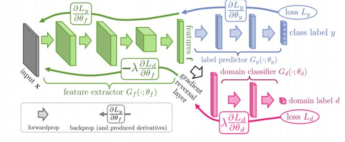
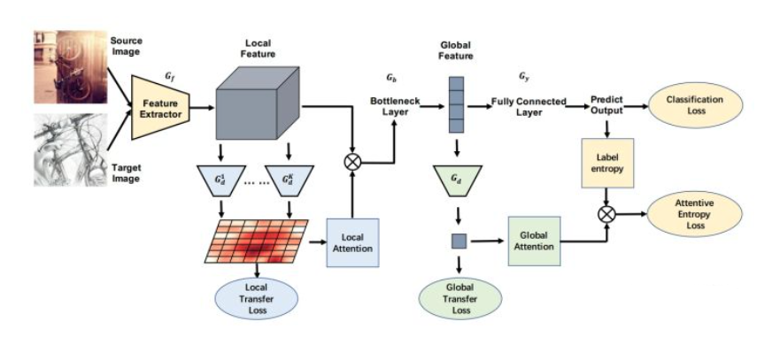

## 文章简介

## 什么是迁移学习？
通俗来讲用一个成语形容最为恰当——**举一反三**。迁移学习利用和综合从类似任务中提炼出来的知识，以及从过去积累的宝贵经验，以促进学习新的问题。核心在于找到现有知识与新知识的共同点/相似性。

举个栗子，小包学会骑自行车后，电动车、摩托车都可以很快上手，但驾驶汽车则需要重新系统学习。在举个栗子，比如，你学习编程，首先学会了 `C` 语言，有了 `C` 语言的基础，你很快就可以类比学习 `Python` 、`Java` 等计算机语言，但 `C` 语言不会对学习日语有帮助。

迁移学习中，研究人员通常将数据分为源数据和目标数据。源数据指与要解决的任务并不直接相关的其他数据，通常具有较大的数据集。目标数据是与任务直接相关的数据，数据量一般较小。

迁移学习要做的就是充分利用源数据来帮助模型提高其在目标数据上的性能。

举个栗子，小包正在学习的 `NILM` 电表 `V-I ` 轨迹识别方向，相关的公共数据集最多达到几万数据，并且没有针对 NILM 的预先训练模型被提出，但有很多图像识别模型，例如 AlexNet、VGG-16、googlet和ResNet-50 等。这些模型是基于数百万张图像精心训练的，我们如果将这些模型迁移到 NILM 中，会大大提高 NILM 轨迹识别的精准度。

迁移学习中如果源域与目标域的知识相关度低，迁移学习后的效果也会比较差，这被称为“负迁移”。例如文字数据模型迁移到图像数据模型，迁移性能就会比较差。但对于文字迁移到图像，并非没有解决方案，我们可以通过一个或多个中间域来连接两个看似不相关的领域，这被称为**“传递性迁移学习”**，传递性迁移学习也是研究人员关注的热点之一。

例如为了实现文本和图像之间的迁移，文献《Transitive Transfer Learning  in Proceedings of the 21th ACM SIGKDD International Conference onKnowledge Discovery and Data Mining - KDD ’15》使用带注释的图像作为中间域。

## 为什么要进行迁移学习？
> 在 AI(人工智能) 和 ML(机器学习) 领域，迁移学习在人工智能中使用的动机比以往任何时候都要强烈，因为它可以解决大量的训练数据和训练成本这两个限制。

关于为什么要进行迁移学习，王晋东等教授将其总结为四个方面:
1. 大数据与少标注之间的矛盾：大数据时代每时每刻产生海量数据，但数据缺乏完善的数据标注，而机器学习模型的训练和更新都依赖于数据的标注，目前只有很少的数据被标注。
2. 大数据与弱计算之间的矛盾: 海量的数据需要消耗巨大的存储和算力，强计算能力是非常昂贵的，此外海量数据的训练需要耗费大量的时间，因此导致了大数据与弱计算之间的矛盾。
3. 普适化模型与个性化需求之间的矛盾: 机器学习的目的是构建尽可能通用的模型来满足不同用户、不同设备、不同环境的不同需求，这就要求模型有高的泛化能力，但是实际中普世化的通用模型无法满足个性化、差异化的需求，这就导致了模型同个性化需求之间的矛盾。
4. 特定应用的需求: 现实中往往存在着一些特定的应用，比如推荐系统的冷启动问题，这就需要我们尽可能利用已有的模型或知识来求解问题。

综上所述，我们在使用人工智能解决问题的时候，最大的障碍在于模型训练需要大量的数据和参数，一方面我们通常无法得到构建模型所需规模的数据(带标注)；另一方面，模型的训练需要消耗大量的时间。而迁移学习，可以利用来自类似任务的有价值的知识和以前的经验来显著提高传统的 AI 技术的学习性能。

## 迁移学习优点

总结来看迁移学习相较于以往的机器学习和深度学习，有以下优点:
+ 提高训练数据的质量和数量: 迁移学习通过从具有大量高质量数据的相似领域中选择和转移知识
+ 加速学习过程: 得益于从其他类似领域共享的宝贵知识和/或过去学到的知识，可以显著提高学习速率
+ 减少计算量: 迁移学习中大部分的数据在被训练的模型转移到目标域之前，都是经过其他源域的训练，从而大大减少了目标域的训练过程的计算需求。
+ 减少通信开销: 不需要发送大量的原始数据，只需要传输知识
+ 保护数据隐私: 用户无需从其他领域的原始数据中学习，只需从自己训练过的模型(通过权重表示)中学习即可，因此可以保护数据隐私

## 迁移学习方法分类
### 基于样本的迁移
基于样本的迁移是根据某个相似度匹配原则从源域数据集中挑选出和目标域数据相似度比较高的样本，并把这些样本迁移到目标域中帮助目标域模型的学习，从而解决目标域中有标签样本不足或无标签样本的学习问题。

一般通过源域与目标域的相似度来训练样本的权重，相似度大的源域数据样本认为和目标域数据关联性比较强对目标域数据学习有利被提高权重，否则权重则被降低。

传统的方法是样本加权方法，使用判别区分源数据和目标数据方法、核平均匹配方法、函数估计方法等来估计权重，但**权重要计算源域与目标域的密度比(MMD 及 KL 等距离量度)，计算难度较大**

### 基于模型参数的迁移
基于模型的迁移学习是在模型层次上源任务和目标任务共享部分通用知识，包括模型参数、模型先验知识和模型架构，分为基于共享模型成分的知识迁移和基于正则化的知识迁移两类。前者利用源域的模型成分或超参数来确定目标域模型；后者通过限制模型灵活性来防止模型过拟合。

通俗点来说就是，先使用源域的大量数据对模型预训练，然后将得到的权重参数进行迁移，最后使用少量目标数据重新训练全连接层。
### 基于特征的迁移
特征迁移法核心在于寻找源域与目标域之间的典型特征来进一步弱化两个域之间的差异从而实现知识的跨领域迁移和服用。

特征迁移方法根据是否在原有特征中进行选择进一步的又可分为特征提取迁移学习方法和特征映射迁移学习方法。优点是可以利用模型间的相似性，缺点是模型参数不易收敛。

#### 特征提取迁移方法
定义: 对源域中经过预训练的局部网络进行重用，将其转变为目标域深度网络的一部分。

通常将 `CNN` 模型作为特征提取器，然后使用少量数据对网络进行微调，基于不同的微调策略训练出来的 `CNN` 模型性能也不同，所以微调策略是该类方法被关注的重点。目前的微调策略主要是多尺度特征迁移，通过微调不同的网络层来学习目标数据的特征。
  
### 特征映射迁移方法
定义: 将实例从源域和目标域映射到新的数据空间，在新的数据空间中，来自两个域的实例具有相似的数据分布，适合用于联合深度神经网络

特征映射迁移方法通过调整源域数据的边际分布或条件分布后进行特征映射，以扩大训练集的规模，增强迁移学习的效果。

> 相比与特征提取迁移方法，特征映射迁移学习更加繁琐。首先，要找到源域和目标域之间共同的特征表示，再将数据从原始特征空间映射到新的特征空间中。

基于特征的迁移学习适用范围较广，不管源域和目标域数据是否有标签都能使用。然而，当数据有标签时，域不变性的度量值不易计算；当数据无标签时，学习跨域通用特征也较困难。
## 迁移学习发展趋势

### 迁移学习结合生成对抗网络
> 生成式对抗网络（GAN, Generative Adversarial Networks ）是一种深度学习模型，是近年来复杂分布上无监督学习最具前景的方法之一。模型通过框架中（至少）两个模块：生成模型（Generative Model）和判别模型（Discriminative Model）的互相博弈学习产生相当好的输出。

生成对抗网络 GAN 是近年应用比较广泛的一种数据增强方法，该方法能够生成与真实样本相似的虚假样本，从而可以扩充训练样本，达到提升模型性能的效果。

GAN 与迁移学习结合形成 DANN 域对抗网络(下图是 DANN 域对抗网络的结构)，DANN 域对抗网络直接优化源域上的损失；用对抗的方法优化源域和目标域间的HΔH距离；最小化了目标域的损失上界。不过对于DANN这种网络而言，训练难度会比较大，而且很难从单源域拓展到多源域，这也是我们后面需要解决的问题。

#### 迁移学习结合注意力机制
> 注意力机制（Attention Mechanism）源于对人类视觉的研究。在认知科学中，由于信息处理的瓶颈，人类会选择性地关注所有信息的一部分，同时忽略其他可见的信息。注意力机制主要有两个方面：决定需要关注输入的哪部分；分配有限的信息处理资源给重要的部分。———— 百度百科

文献《Transferable Attention for Domain Adaptation》提出了 TADA(下图是TADA结构图) 方法通过注意力机制挑选出可迁移的图像以及图像中可以重点迁移的区域，提高模型性能。并且提出了两个与注意力机制结合的迁移过程：Transferable Local Attention和Transferable Global Attention

注意力机制可以一定程度上提升模型的准确性，但是也会占用过多计算资源。因此近年来各种轻量级注意力机制被提出，但轻量级注意力机制会损失一定模型精度。因此如何在保证精度的前提下，将轻量化注意力机制与迁移学习方法更有效地结合，是有待研究的问题。

### 迁移学习结合联邦学习
> 联邦学习是一种机器学习设定，其中许多客户端在中央服务器的协调下共同训练模型，同时保持训练数据的去中心化及分散性。
联邦学习的长期目标：在不暴露数据的情况下分析和学习多个数据拥有者的数据。（目的：解决数据孤岛）

2020 年全球人工智能和机器人峰会（简称“CCF-GAIR 2020”），杨强教授介绍了联邦学习的关键技术以及应用案例，并进一步介绍了最新开展的联邦学习和迁移学习的结合研究以及接下来的重点研究方向。

杨强教授表示，我们建立的 AI 离不开人，保护人的隐私是当下AI 发展中特别重要的一点，这也是从政府到个人、企业以及社会的要求；另外，AI也要保护模型的安全，防止恶意或非恶意的攻击。数据隐私成为 AI 发展不得不迈过的一道难关。

而联邦迁移血学习(FTL) 通过应用同态加密（Homomorphic Encryption）和多项式近似代替差分隐私（Polynomial Approximation instead of Differential Privacy）的方法，为特定行业提供了一种更安全、更可靠的方法。与此同时，基于迁移学习的的特性，FTL 的参与方可以拥有自己的特征空间，而无需强制要求所有参与方都拥有或使用相同特征的数据，这使得 FTL 适合于更多的应用场景。
### 迁移学习领域度量度的研究
因为迁移学习的性能在很大程度上取决于领域之间的相似度。因此度量方法的研究是迁移学习未来研究的重要领域之一，度量的准确性，计算方便性都会影响迁移学习的发展。
### 多源域迁移知识
仅从一个源域迁移知识是局限的，如果能实现多个领域知识的综合学习，即将多元学习和迁移学习结合起来，这样可以增加寻找到和对目标域学习更加有利知识的机会，从而提高迁移学习的学习效率与效果，使得迁移学习变的更加安全与稳定，有效避免负迁移的发生。
## 参考链接
+ 参考文献《Jindong Wang et al. Transfer Learning Tutorial. 2018.》
+ 参考文献《Domain-Adversarial Training of Neural Networks（DANN）》
+ 参考文献《Transferable Attention for Domain Adaptation》
+ 参考文献《迁移学习研究综述》
+ [联邦学习(联合学习) Federated Learning(FL)](https://blog.csdn.net/hxxjxw/article/details/108191010)
+ [联邦学习 OR 迁移学习？No，我们需要联邦迁移学习](https://blog.csdn.net/weixin_42137700/article/details/110182798)